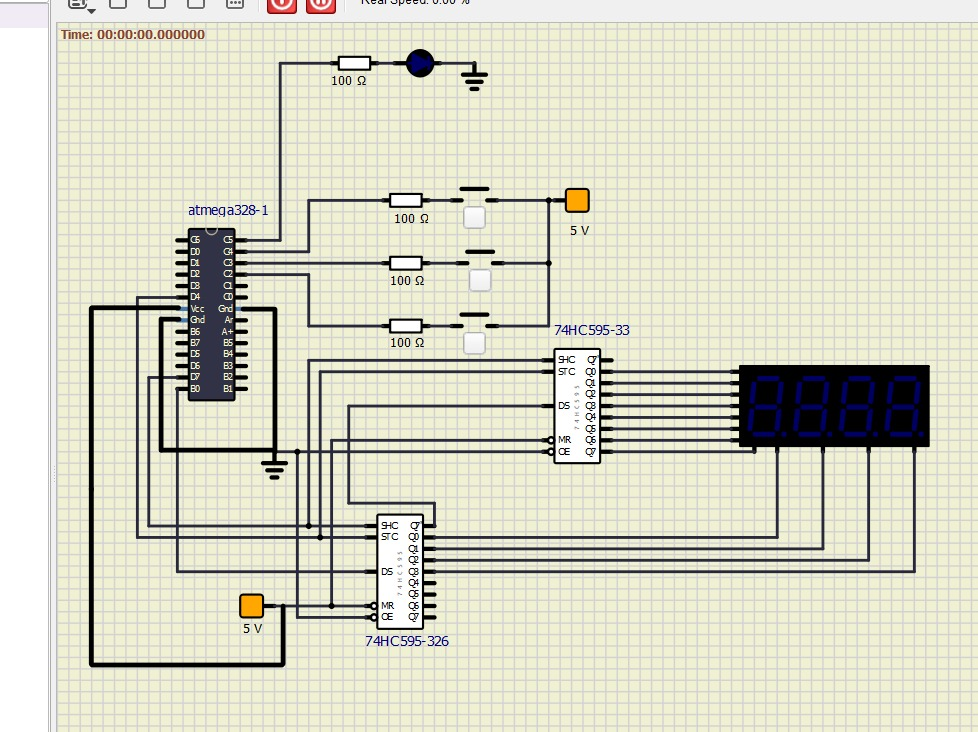

# Lab 5: TEODOR COSMA

Link to your `Digital-electronics-2` GitHub repository:

   [https://github.com/...](https://github.com/...)


### 7-segment library

1. In your words, describe the difference between Common Cathode and Common Anode 7-segment display.
   * CC SSD
   * CA SSD

The difference between the two displays is that the CC has all cathodes connections of the LEDs are together, and the CA has all the anodes connections of the LEDs are together. 

Another difference is that CC is active HIGH, and CA is active LOW, which means the CC segments are illuminated by applying logic 0 to the segment, and CA segments are illuminated by applying logic 1.

2. Code listing with syntax highlighting of two interrupt service routines (`TIMER1_OVF_vect`, `TIMER0_OVF_vect`) from counter application with at least two digits, ie. values from 00 to 59:

```c
/**********************************************************************
 * Function: Timer/Counter1 overflow interrupt
 * Purpose:  Increment counter value from 00 to 59.
 **********************************************************************/
ISR(TIMER1_OVF_vect) //every 262ms
{   
    // WRITE YOUR CODE HERE
    static uint8_t val0=0,val1=0;
    
    val++;
    if(val0>9) //if it reaches 9, it goes back to 0 and increments the tens
        {val0=0;
        val1++;
        }
    if(val1>5)  //if it reaches 6, it goes back to 0
        val1=0;      
}
```

```c
/**********************************************************************
 * Function: Timer/Counter0 overflow interrupt
 * Purpose:  Display tens and units of a counter at SSD.
 **********************************************************************/
ISR(TIMER0_OVF_vect) //every 4ms
{
    static uint8_t pos = 0; 
    pos++;
    if(pos>1){
        pos=0;
        SEG_update_shift_regs(val0,pos); //changes the number on position 0
    }
    else
        SEG_update_shift_regs(val1,pos); //changes the number on position 1
}
```

3. Flowchart figure for function `SEG_clk_2us()` which generates one clock period on `SEG_CLK` pin with a duration of 2&nbsp;us. The image can be drawn on a computer or by hand. Use clear descriptions of the individual steps of the algorithms.

   


### Kitchen alarm

Consider a kitchen alarm with a 7-segment display, one LED and three push buttons: start, +1 minute, -1 minute. Use the +1/-1 minute buttons to increment/decrement the timer value. After pressing the Start button, the countdown starts. The countdown value is shown on the display in the form of mm.ss (minutes.seconds). At the end of the countdown, the LED will start blinking.

1. Scheme of kitchen alarm; do not forget the supply voltage. The image can be drawn on a computer or by hand. Always name all components and their values.

   
