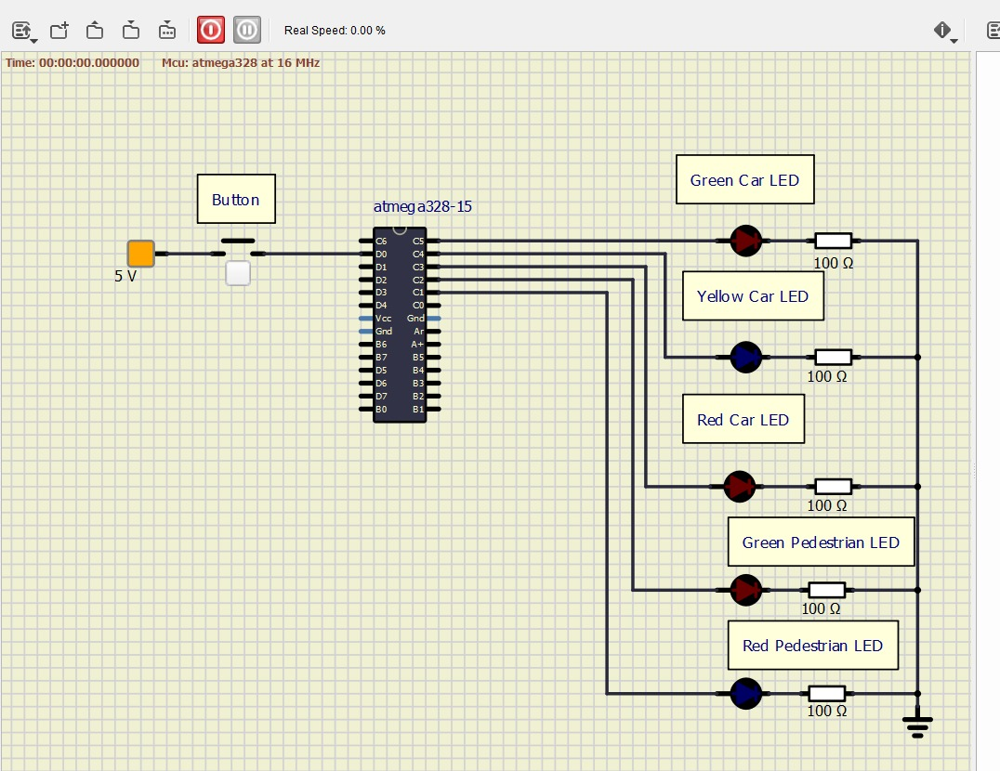

# Lab 3: TEODOR COSMA

Link to your `Digital-electronics-2` GitHub repository:

   [https://github.com/teodorcosma/Digital-electronics-2/](https://github.com/teodorcosma/Digital-electronics-2/)


### Data types in C

1. Complete table.

| **Data type** | **Number of bits** | **Range** | **Description** |
| :-: | :-: | :-: | :-- | 
| `uint8_t`  | 8 | 0, 1, ..., 255 | Unsigned 8-bit integer |
| `int8_t`   | 8 | [-127,128] | Signed 8bit integer |
| `uint16_t` | 16 | [0,65535] | Unsigned 16bit integer |
| `int16_t`  | 16 | [-32768,32767] | Signed 16bit integer |
| `float`    | 32 | -3.4e+38, ..., 3.4e+38 | Single-precision floating-point |
| `void`     | - | - | Empty variaible |


### GPIO library

1. In your words, describe the difference between the declaration and the definition of the function in C.
   * Function declaration
   * Function definition

*The declaration of a function is the information that tells the compiler about the function's name, return type and parameters, whereas the definition is the body of the function.*

2. Part of the C code listing with syntax highlighting, which toggles LEDs only if push button is pressed. Otherwise, the value of the LEDs does not change. Use function from your GPIO library. Let the push button is connected to port D:

```c
    // Configure Push button at port D and enable internal pull-up resistor
    // WRITE YOUR CODE HERE

   /* Configuring the blue and red LEDs to be on and off separately,
and configuring the ports C and B to be output ports, 
then configuring the button*/
 GPIO_config_output(&DDRB, BLUE_LED);
 GPIO_config_output(&DDRC, RED_LED);
 GPIO_write_low(&PORTB, BLUE_LED);
 GPIO_write_high(&PORTC, RED_LED);
 GPIO_config_input_pullup(&DDRD, BUTTON);
 while (1)
 {
 _delay_ms(BLINK_DELAY);
if (GPIO_read(&PIND, BUTTON) == 0)
{
GPIO_toggle(&PORTB, BLUE_LED);
GPIO_toggle(&PORTC, RED_LED);
}
 }
 // Will never reach this
 return 0;
```


### Traffic light

1. Scheme of traffic light application with one red/yellow/green light for cars and one red/green light for pedestrians. Connect AVR device, LEDs, resistors, one push button (for pedestrians), and supply voltage. The image can be drawn on a computer or by hand. Always name all components and their values!

   
   
  _I cannot add a VCC, because SimulIDE already says that the ATMEGA has VCC_
