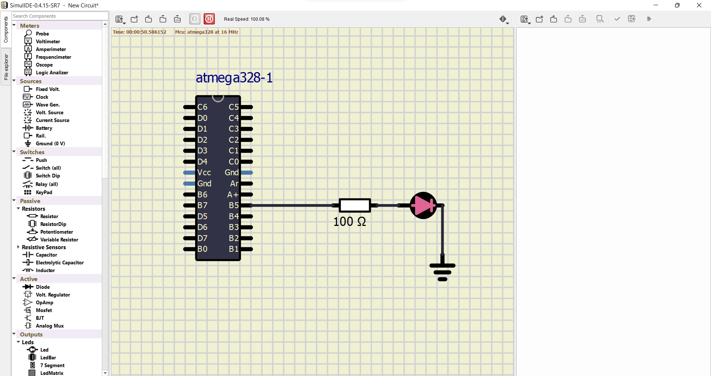

# Lab 1: YOUR_FIRSTNAME FAMILYNAME

Link to your `Digital-electronics-2` GitHub repository:

   [https://github.com/teodorcosma/Digital-electronics-2/](https://github.com/teodorcosma/Digital-electronics-2/)


### Blink example

1. What is the meaning of the following binary operators in C?
   * `|` This is the bitwise OR operator
   * `&` This is the bitwise AND operator
   * `^` This is the bitwise XOR operator
   * `~` This is the bitwise NOT operator
   * `<<` This is the LEFT SHIFT operator
   * `>>` This is the RIGHT SHIFT operator

2. Complete truth table with operators: `|`, `&`, `^`, `~`

| **b** | **a** |**b \| a** | **b \& a** | **b \^ a** | **\~ b** |
| :-: | :-: | :-: | :-: | :-: | :-: |
| 0 | 0 | 0 | 0 | 0 | 1 |
| 0 | 1 | 1 | 0 | 1 | 1 |
| 1 | 0 | 1 | 0 | 1 | 0 |
| 1 | 1 | 1 | 1 | 0 | 0 |


### Morse code

1. Listing of C code with syntax highlighting which repeats one "dot" and one "comma" (BTW, in Morse code it is letter `A`) on a LED:

```c
int main(void)
{
    // Set pin as output in Data Direction Register
    // DDRB = DDRB or 0010 0000
    DDRB = DDRB | (1<<LED_GREEN);

    // Set pin LOW in Data Register (LED off)
    // PORTB = PORTB and 1101 1111
    PORTB = PORTB & ~(1<<LED_GREEN);

    // Infinite loop
    while (1)
    {
        // Pause several milliseconds
        _delay_ms(SHORT_DELAY);

        // WRITE YOUR CODE HERE
        	/*
		The First command is the point, it turns the led on for 1 short delay.
		The second, turns of the led for 1 short delay.
		The last turns the LED on for 2 short delay, to represent the dash.
		*/
        	PORTB = PORTB ^ (1<<LED_GREEN);//first (on, 1*short delay)
		_delay_ms(SHORT_DELAY);
		
		PORTB = PORTB & ~(1<<LED_GREEN);//second (off, 1*short delay)
		_delay_ms(SHORT_DELAY);
		
		PORTB = PORTB ^ (1<<LED_GREEN);//third (on, 2*short delay)
		
    }

    // Will never reach this
    return 0;
}
```


2. Scheme of Morse code application, i.e. connection of AVR device, LED, resistor, and supply voltage. The image can be drawn on a computer or by hand. Always name all components and their values!

   
